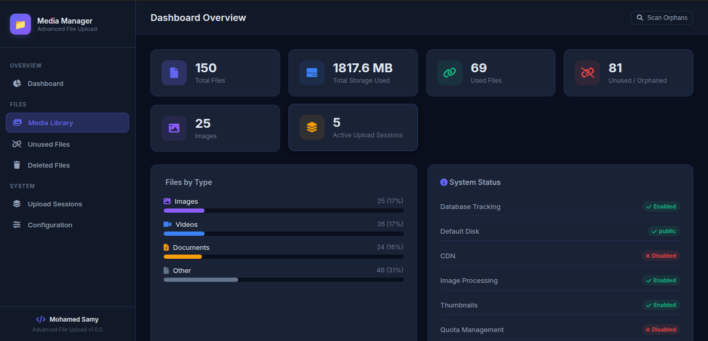

# Laravel Media Vault

A highly scalable, production-ready file and media management package for Laravel. It provides unified management for centralized uploads and custom polymorphic model fields, seamlessly handling URL downloads, image processing, massive datasets with robust memory safety, and chunked resumable uploads.

[](https://packagist.org/packages/mohamedsamy902/laravel-media-vault)
[](https://php.net)
[](https://laravel.com)
[](LICENSE.md)
[]()




## Table of Contents
1. [Features](#1-features)
2. [Requirements](#2-requirements)
3. [Installation](#3-installation)
4. [Configuration](#4-configuration)
5. [Usage Examples](#5-usage-examples)
6. [Response Format](#6-response-format)
7. [Database Model](#7-database-model)
8. [Dashboard & Media Manager UI](#8-dashboard--media-manager-ui)
9. [Cloud Storage Setup](#9-cloud-storage-setup)
10. [Console Commands](#10-console-commands)
11. [⚠️ Danger Zone / Known Limitations](#11-️-danger-zone--known-limitations)
12. [Testing](#12-testing)
13. [Advanced Security & Performance Features](#13-advanced-security--performance-features)
14. [Security](#14-security)
15. [Contributing](#15-contributing)
16. [Changelog](#16-changelog)
17. [License](#17-license)

---

## 1. Features

- **Upload Handlers:** Direct File Upload, Multiple (Batch) Uploads, Chunked (Resumable) Uploads, and Uploads from URL.
- **Image Processing:** On-the-fly resizing, format conversion (e.g. `webp`), optimization, and watermarking via Intervention Image v3.
- **Storage Integration:** Out-of-the-box support for Local disks, Amazon S3, Google Cloud Storage, and CDN URL rewriting.
- **Multi-Source Media:** Auto-discovery of custom Eloquent models via the `HasMediaFields` trait alongside the central polymorphic repository (`HasUploads`).
- **Database Tracking:** Comprehensive file tracking with usage state, polymorphic ownership, and soft deletion.
- **Dashboard SPA:** Built-in UI to manage files, view statistics, and handle orphans directly.
- **Bulk Deletion Safety Net:** 2-step verification (Preview → Token → Execute) for mass deletions to prevent catastrophic data loss.
- **Security & Quotas:** Strict SSRF URL validation, user-level storage quotas, strict MIME binary validation, and SVG entity expansion sanitization.

---

## 2. Requirements

| Requirement | Version | Notes |
|-------------|---------|-------|
| PHP | `^8.2` | |
| Laravel | `>=10.0` | |
| Extensions | `ext-gd` or `ext-imagick` | Required for image processing |

---

## 3. Installation

**1. Install via Composer:**
```bash
composer require mohamedsamy902/laravel-media-vault
```

**2. Publish Configuration:**
```bash
php artisan vendor:publish --tag="media-vault-config"
```

**3. Run Migrations (Optional, requires `database.enabled = true`):**
```bash
php artisan migrate
```

---

## 4. Configuration

This package is highly customizable through `config/media-vault.php`. Below is a comprehensive list of every configuration key available.

### Storage (`storage`)
| Key | Type | Default | Description |
|-----|------|---------|-------------|
| `storage.disk` | string | `'public'` | The default Laravel storage disk to use. |
| `storage.path` | string | `'uploads'` | The base directory inside the selected disk. |
| `storage.default_folder` | string | `'default'` | The default subfolder used if none is specified during upload. |
| `storage.cdn.enabled` | boolean | `false` | Whether to replace the storage URL domain with a CDN domain. |
| `storage.cdn.url` | string | `''` | The base URL of your CDN. |

### Validation (`validation`)
Contains standard Laravel validation strings mapped to file types (`image`, `video`, `audio`, `document`, `other`, `custom_fields`). Used internally to validate incoming files based on rules like sizes and MIME types.

### URL Upload / Download (`url_download` & `url_upload`)
| Key | Type | Default | Description |
|-----|------|---------|-------------|
| `url_download.enabled` | boolean | `true` | Allow uploading files via a remote URL. |
| `url_download.chunked` | boolean | `true` | True = load into memory; False = stream to disk directly. |
| `url_download.chunk_size` | int | `5242880` | Size of streaming chunks (5MB). |
| `url_download.allowed_mimes`| array | `[...]` | Whitelisted extensions for URL downloads grouped by type. |
| `url_upload.allowed_domains`| array | `[]` | Allowed domains for SSRF protection (empty = allow all public). |
| `url_upload.timeout_seconds`| int | `10` | Hard timeout for the download HTTP request (overrides legacy `url_download.timeout`). |
| `url_upload.max_size_bytes` | int | `52428800`| Max file size allowed from a URL (50MB default) (overrides legacy `url_download.max_size`). |

### Image Processing (`image_driver` & `processing`)
| Key | Type | Default | Description |
|-----|------|---------|-------------|
| `image_driver` | string | `'gd'` | `'gd'` or `'imagick'` (Requires corresponding PHP extension). |
| `processing.image.enabled` | boolean | `true` | Enable/disable all image processing features. |
| `processing.image.resize` | array | `[...]` | Contains `width`, `height`, `maintain_aspect_ratio`, and `upsize`. |
| `processing.image.watermark`| array | `[...]` | Contains `enabled`, `path`, `position`, `opacity`, `x_offset`, `y_offset`. |
| `processing.image.filters` | array | `[]` | Allowed filters: `brightness`, `contrast`, `greyscale`, `blur`. |
| `processing.image.convert_to`| string\|null | `'webp'`| Global format conversion target (e.g. `webp`, `jpg`). |
| `processing.image.quality` | int | `85` | Compression quality (1-100). |
| `processing.image.optimize` | boolean | `false` | Optional integration for Spatie image optimizer. |
| `processing.video.enabled` | boolean | `false` | Enable video processing features. |
| `processing.video.convert_to`| string | `'mp4'` | Target video format. |
| `processing.video.bitrate` | string | `'1000k'` | Target video bitrate. |
| `processing.video.resolution`| string | `'1280x720'`| Target video resolution. |

### Thumbnails (`thumbnails`)
| Key | Type | Default | Description |
|-----|------|---------|-------------|
| `thumbnails.enabled` | boolean | `true` | Automatically generate thumbnails during image upload. |
| `thumbnails.sizes` | array | `[...]` | Associative array of sizes (e.g. `small => ['width' => 150, 'crop' => true]`). |
| `thumbnails.for_videos` | boolean | `false` | Generate thumbnails for video files (requires FFmpeg). |
| `thumbnails.seconds` | int | `5` | Second to capture for video thumbnails. |

### Quota Management (`quota`)
| Key | Type | Default | Description |
|-----|------|---------|-------------|
| `quota.enabled` | boolean | `false` | Enable storage quotas per user. |
| `quota.max_size_per_user` | int | `1073741824`| 1 GB default max size. |
| `quota.key_column` | string | `'user_id'` | DB column to identify owner. Change to `tenant_id` for multi-tenant. |
| `quota.warning_threshold` | float | `0.9` | Fraction (e.g. 0.9 = 90%) to trigger `QuotaWarning` event. |
| `quota.check_method` | string | `'database'`| Method for checking quota (`database` or `session`). |

### Multi-Source & DB Tracking (`media_models`, `database`)
| Key | Type | Default | Description |
|-----|------|---------|-------------|
| `media_models` | array | `[]` | List of Custom Eloquent models using `HasMediaFields`. |
| `max_orphan_scan_limit` | int | `100000` | Cap on files scanned per run to prevent memory exhaustion. |
| `database.enabled` | boolean | `true` | Track uploads in the `file_uploads` table. |
| `database.model` | string | `FileUpload::class` | Class reference for the database model. |
| `database.table` | string | `'file_uploads'`| Database table name. |
| `database.prune_after` | int\|null| `30` | Days to retain soft-deleted/unused records before physical prune. |

### Security & Chunks (`security`, `chunked`)
| Key | Type | Default | Description |
|-----|------|---------|-------------|
| `security.bulk_delete_warning_threshold`| int | `100` | Deletions exceeding this require an extra warning. |
| `security.strict_mime_validation`| boolean | `true` | Validate file binary magic bytes against declared MIME type. |
| `security.rate_limit.enabled`| boolean | `false` | Enable upload rate limiting. |
| `security.rate_limit.max_uploads`| int | `60` | Max uploads per time window. |
| `security.rate_limit.per_minutes`| int | `1` | Time window in minutes. |
| `security.virus_scan.enabled`| boolean | `false` | Enable ClamAV virus scanning. |
| `security.virus_scan.driver`| string | `'clamav'`| Virus scanning driver. |
| `security.virus_scan.path`| string | `'/usr/bin/clamscan'`| Path to the ClamAV executable. |
| `chunked.session_ttl_hours` | int | `24` | Hours to keep pending resumable upload sessions before expiration. |

### Advanced Features (`temp_url`, `compression`, `logging`)
| Key | Type | Default | Description |
|-----|------|---------|-------------|
| `temp_url.route_prefix` | string | `'media-vault-urls'`| Prefix for temporary signed URL routes. |
| `temp_url.middleware` | array | `[]` | Middleware for temporary signed URLs. |
| `compression.enabled` | boolean | `false` | Enable file compression (e.g., zip) before storage. |
| `compression.types` | array | `[...]` | File extensions eligible for compression. |
| `compression.quality` | int | `80` | Compression quality level. |
| `logging.enabled` | boolean | `true` | Enable internal operation logging. |
| `logging.level` | string | `'info'` | The log level to use. |

### UI Dashboard (`ui`)
| Key | Type | Default | Description |
|-----|------|---------|-------------|
| `ui.route_prefix` | string | `'media-vault'`| Base URL for the Media Manager Dashboard. |
| `ui.middleware` | array | `['web']` | **CRITICAL:** Add `'auth'` to protect the dashboard! |

---

## 5. Usage Examples

### Single & Multiple File Upload via HTTP Request
```php
use MohamedSamy902\LaravelMediaVault\Facades\MediaVault;
use Illuminate\Http\Request;

public function store(Request $request) {
    // Single file
    $result = MediaVault::upload($request, [
        'field_name' => 'avatar',
        'folder_name' => 'avatars',
        'convert_to' => 'webp',
        'quality' => 90
    ]);

    // Batch files (using name="files[]" in HTML)
    $results = MediaVault::upload($request, [
        'field_name' => 'files' // Automatically processes all array items
    ]);
}
```

### Direct Upload with UploadedFile
```php
use MohamedSamy902\LaravelMediaVault\Facades\MediaVault;

// Assuming $file is an Illuminate\Http\UploadedFile instance
$result = MediaVault::upload($file, [
    'disk' => 's3',
    'folder_name' => 'documents',
]);
```

### Upload from Remote URL
```php
use MohamedSamy902\LaravelMediaVault\Facades\MediaVault;

// Single URL
$result = MediaVault::uploadFromUrl('https://example.com/image.jpg', [
    'folder_name' => 'downloads',
    'disk' => 's3'
]);

// Multiple URLs
$results = MediaVault::uploadFromUrl([
    'https://example.com/file1.pdf',
    'https://example.com/file2.pdf'
], [
    'folder_name' => 'downloads'
]);
```

### Upload Methods & Integration Scenarios

The package supports three distinct integration approaches depending on your application frontend architecture:

#### Option A: Traditional Blade HTML Form (No JS / Non-Chunked)
For standard Laravel applications submitting traditional HTML forms directly to the backend:

**Blade Template (`resources/views/upload.blade.php`):**
```html
<form action="/upload" method="POST" enctype="multipart/form-data">
    @csrf
    <input type="file" name="avatar" required>
    <button type="submit">Upload File</button>
</form>
```

**Laravel Controller:**
```php
use MohamedSamy902\LaravelMediaVault\Facades\MediaVault;

public function store(Request $request) {
    $request->validate(['avatar' => 'required|file|max:10240']);

    $result = MediaVault::upload($request, [
        'field_name'  => 'avatar',
        'folder_name' => 'avatars',
        'convert_to'  => 'webp',
    ]);

    return back()->with('success', 'File uploaded: ' . $result->url);
}
```

---

#### Option B: Resumable Chunked Uploads (Blade + JS Client)
For web applications requiring client-side progress bars and auto-resumption across page refreshes or network drops:

**Blade Template (`resources/views/resumable-upload.blade.php`):**
```html
<link rel="stylesheet" href="{{ asset('vendor/media-vault/media-vault.css') }}">

<!-- Auto-rendered container for interrupted upload prompts -->
<div id="afu-resume-container"></div>

<input type="file" id="afu-fileInput" multiple>
<button onclick="startUpload()">Start Upload</button>

<script src="{{ asset('vendor/media-vault/media-vault.js') }}"></script>
<script>
    function startUpload() {
        window.afuUploadFile({
            inputId: 'afu-fileInput',
            uploadUrl: '/media-vault/upload',
            onProgress: function(percent, chunk, total, file) {
                console.log(`Progress (${file.name}): ${percent}% (Chunk ${chunk}/${total})`);
            },
            onSuccess: function(file, sessionId) {
                console.log(`Upload completed for ${file.name}`);
            },
            onError: function(err, file) {
                console.error(`Upload error: ${err.message}`);
            }
        });
    }
</script>
```

##### Frontend JS Client Capabilities (`media-vault.js`)
- **Per-File LocalStorage Fingerprint:** Each file is uniquely hashed by `afu_upload_${file.name}_${file.size}_${file.lastModified}`.
- **Incremental Persistence:** Updates `localStorage` after every successful chunk and purges state when complete.
- **Concurrent Multi-File Transfers:** Supports uploading multiple files in parallel (`afuUploadFiles([file1, file2])`).
- **Auto-Detection on Page Load:** Automatically queries the backend for pending sessions on `DOMContentLoaded` and renders a **Resume Card** to re-send missing chunks only.

---

#### Option C: Mobile Applications & REST APIs (Flutter, React Native, Swift, Kotlin)
For mobile applications or single-page applications (SPAs) connecting via REST endpoints:

##### 1. Send Chunks Sequentially
Upload binary chunk data to `POST /media-vault/upload` (or your custom API endpoint):
```http
POST /media-vault/upload HTTP/1.1
Content-Type: multipart/form-data; boundary=----FormBoundary

------FormBoundary
Content-Disposition: form-data; name="file"; filename="blob"
Content-Type: application/octet-stream

<Binary Chunk Data>
------FormBoundary
Content-Disposition: form-data; name="chunkNumber"

1
------FormBoundary
Content-Disposition: form-data; name="totalChunks"

5
------FormBoundary
Content-Disposition: form-data; name="originalName"

video.mp4
------FormBoundary--
```

**Response (First Chunk):**
```json
{
  "status": true,
  "sessionId": "9b1deb4d-3b7d-4bad-9bdd-2b0d7b3dcb6d",
  "done": 20,
  "missing": [1, 2, 3, 4]
}
```
*Mobile App stores `sessionId` in local storage (`SharedPreferences` / `AsyncStorage` / `Hive`).*

##### 2. Query Session Ground Truth on Re-Open / Resume
If the mobile app crashes or network disconnects, query the session status to get the exact missing chunk indices:

```http
GET /media-vault/sessions/9b1deb4d-3b7d-4bad-9bdd-2b0d7b3dcb6d/status HTTP/1.1
Accept: application/json
```

**Response:**
```json
{
  "status": true,
  "session_id": "9b1deb4d-3b7d-4bad-9bdd-2b0d7b3dcb6d",
  "original_name": "video.mp4",
  "total_chunks": 5,
  "uploaded_count": 2,
  "progress_percentage": 40,
  "missing_chunks": [2, 3, 4],
  "is_complete": false,
  "expires_at": "2026-08-10T12:00:00Z"
}
```

##### 3. Send Missing Chunks & Complete Assembly
The mobile app sends only the indices listed in `missing_chunks` along with the `sessionId`. When the final chunk arrives, the server returns the completed `UploadResult` JSON object.

### Using Central DB Tracking (`HasUploads`)
Use the `HasUploads` trait to link files to your models polymorphically via the `file_uploads` table.

```php
use Illuminate\Database\Eloquent\Model;
use MohamedSamy902\LaravelMediaVault\Traits\HasUploads;

class User extends Model {
    use HasUploads;
}

$user = User::find(1);
// Retrieve the latest image URL directly
$avatarUrl = $user->getMediaUrl('image', 'medium'); // Returns medium thumbnail or original
// Get all available thumbnails
$thumbnails = $user->getThumbnails();
```

### Multi-Source Media Setup (`HasMediaFields`)
Use the `HasMediaFields` trait on models where you want to store file paths directly in the model's table columns, bypassing the central `file_uploads` table tracking while retaining the package UI, URL resolution, and scanners.

```php
use Illuminate\Database\Eloquent\Model;
use MohamedSamy902\LaravelMediaVault\Traits\HasMediaFields;

class Product extends Model {
    use HasMediaFields;

    // Define the custom media fields
    protected array $mediaFields = [
        'cover_image' => ['multiple' => false, 'disk' => 'public'],
        'gallery'     => ['multiple' => true,  'disk' => 's3'],
    ];
}

$product = Product::find(1);
$url = $product->getMediaUrl('cover_image');
```
Run `php artisan media-vault:discover-models` to auto-register this model in your configuration cache.

### Generating Thumbnails & Watermarks
Thumbnails and watermarks are generated automatically based on `config/media-vault.php`.
```php
// If thumbnails.enabled = true, they are generated silently on upload.
// If processing.image.watermark.enabled = true, it is applied directly to the original file.
$result = MediaVault::upload($request);

// Access thumbnails via response
$smallThumb = $result->toArray()['thumbnail_urls']['small'] ?? null;
```
**Warning:** Watermarking is a destructive operation. It overrides the original image.

### Deleting Files
```php
use MohamedSamy902\LaravelMediaVault\Facades\MediaVault;

// Delete by Database ID
$result = MediaVault::delete(15);

// Delete by Path
$result = MediaVault::delete('uploads/default/image.webp');

// Bulk Delete by Array of IDs or Paths
$results = MediaVault::delete([15, 16, 'uploads/default/test.png']);
```

### Bulk Deletion Guard
Available in the `BulkDeletionGuard` utility service. Always preview a massive deletion action and generate a secure token to proceed.
```php
use MohamedSamy902\LaravelMediaVault\Security\BulkDeletionGuard;
use MohamedSamy902\LaravelMediaVault\Contracts\FileRepositoryContract;

$guard = new BulkDeletionGuard(app(FileRepositoryContract::class));

// Step 1: Preview and obtain a token
$preview = $guard->preview($paths, 'api');
// returns: ['token' => '...', 'count' => 150, 'requires_extra_warning' => true, 'sample' => [...]]

// Step 2: Execute using the token
$result = $guard->execute($preview['token'], forceHardDelete: true);
```

---

## 6. Response Format

All successful uploads return an `UploadResult` object. It seamlessly implements `ArrayAccess` and `JsonSerializable`.

```json
{
  "status": true,
  "id": 142,
  "path": "uploads/avatars/4f1a2...webp",
  "url": "https://cdn.example.com/uploads/avatars/4f1a2...webp",
  "disk": "s3",
  "original_name": "profile_pic.jpg",
  "mime_type": "image/webp",
  "size": 1048576,
  "thumbnail_urls": {
    "small": "https://cdn.example.com/uploads/avatars/thumbs/4f1a2..._small.webp",
    "medium": "https://cdn.example.com/uploads/avatars/thumbs/4f1a2..._medium.webp"
  }
}
```
Failed items in a batch upload will return an array:
```json
{
  "status": false,
  "error": "The uploaded file is invalid or missing.",
  "original_name": "bad_file.exe"
}
```

---

## 7. Database Model

If `database.enabled` is `true`, all uploads go to the `file_uploads` table. The `FileUpload` model includes powerful query scopes:

```php
use MohamedSamy902\LaravelMediaVault\Models\FileUpload;

$images = FileUpload::images()->get();
$videos = FileUpload::videos()->forUser(auth()->id())->get();
$orphans = FileUpload::unused()->get();

// File properties
$file->url; // Resolves CDN automatically
$file->human_size; // "1.5 MB"
$file->existsOnDisk(); // bool
$file->owner_exists; // Safely checks if the polymorphic owner model still exists
```

---

## 8. Dashboard & Media Manager UI

The package provides a built-in Single Page Application (SPA) dashboard to manage files, view sessions, configure settings, and scan for orphaned files.

- **Route:** `your-app.com/media-vault` (Changeable via `ui.route_prefix`).
- **Security Warning:** You **must** attach the `auth` middleware (or a custom admin middleware) in `config/media-vault.php` under `ui.middleware`. Without this, your entire media library is public.
- Features include real-time cache scans, orphaned file detection, token-based bulk forces deletions, and system statistics.

---

## 9. Cloud Storage Setup

To use Amazon S3 or Google Cloud Storage, you must require their Flysystem adapters. The package will intelligently throw a clear exception if they are missing.

- **S3:** `composer require league/flysystem-aws-s3-v3:^3.0`
- **GCS:** `composer require spatie/laravel-google-cloud-storage:^2.0`

---

## 10. Console Commands

The package registers several utilities to simplify file management:

- `php artisan media-vault:discover-models` — Scans the `app/Models` directory for `HasMediaFields` usage and caches them.
- `php artisan media-vault:regenerate-thumbnails {--force}` — Iterates over the `file_uploads` table and regenerates missing sizes based on config.
- `php artisan media-vault:import-orphans {disk?}` — Scans a physical disk and imports untracked files into the `file_uploads` table to prevent them from being considered orphans.
- `php artisan media-vault:prune-unused {--days=30} {--force} {--dry-run}` — Irreversibly deletes files that have been marked as unused for `N` days.
- `php artisan media-vault:prune-sessions` — Removes expired `UploadSession` records and their physical incomplete temporary chunks.

---

## 11. ⚠️ Danger Zone / Known Limitations

> [!CAUTION]
> Pay strict attention to these operational warnings to prevent data loss in a production environment:

1. **Thumbnails Backfill Limitation:** The command `media-vault:regenerate-thumbnails` works flawlessly for the central `file_uploads` repository. However, it **does NOT support Custom Models (Multi-Source)** currently. Enabling `thumbnails.enabled` retroactively will not backfill thumbnails for custom models.
2. **Watermarks are Destructive:** Enabling `watermark.enabled` prints the watermark directly onto the original image. **There is no backfill, and there is no way to remove a watermark once applied.**
3. **Removing Custom Models = Data Loss Risk:** If you remove a model from `media_models` in the config after files have been uploaded, the scanner will immediately classify its files as "Orphaned". Running the Orphan Deletion will **permanently wipe them**. Always migrate or empty tables before changing configuration topology.
4. **Custom Sources Pagination:** To prevent Server Crashes (OOM) on huge DB tables, the Dashboard pagination for Custom Sources operates on Database Rows, not individual files. A JSON array of 5 images counts as 1 row in pagination.
5. **Caching:** If you register a new model or trait, you must run `php artisan config:clear` so the Dashboard recognizes it.

---

## 12. Testing

The package includes a comprehensive test suite. We specifically isolate heavy tests (Benchmarks) to prevent CI timeouts.

**Run Unit & Feature Tests:**
```bash
composer test
# or
vendor/bin/phpunit
```

**Run Memory & Performance Benchmarks:**
```bash
vendor/bin/phpunit --testsuite=Benchmarks
```

*(Current Test Count: 177 Passing/Skipped Tests).*

---

## 13. Advanced Security & Performance Features

### 🛡️ Virus Scanning (ClamAV Integration)
The package includes built-in automated virus and malware scanning via ClamAV before any file is saved to storage.

- **CLI Executable:** Executes via local `clamscan` binary path configured in `security.virus_scan.path`.
- **EICAR Detection:** Industry-standard test signature `EICAR-STANDARD-ANTIVIRUS-TEST-FILE` is detected out-of-the-box in development and production environments.

```php
// config/media-vault.php
'security' => [
    'virus_scan' => [
        'enabled' => env('FILE_UPLOAD_VIRUS_SCAN', false),
        'driver'  => 'clamav',
        'path'    => env('CLAMSCAN_PATH', '/usr/bin/clamscan'),
    ],
],
```

### ⚡ File & Image Compression
Pipeline-integrated file compression reduces storage footprint for non-image document formats.

- **Scope:** Document formats (`pdf`, `doc`, `docx`, `xls`, `xlsx`, `ppt`, `pptx`).
- **Execution:** Runs directly inside the `StorageManager` write pipeline using quality parameters based on `compression.quality`.

```php
// config/media-vault.php
'compression' => [
    'enabled' => env('FILE_UPLOAD_COMPRESSION_ENABLED', false),
    'quality' => env('FILE_UPLOAD_COMPRESSION_QUALITY', 80), // 1 - 100 quality percentage
    'types'   => ['pdf', 'doc', 'docx', 'xls', 'xlsx', 'ppt', 'pptx'],
],
```

### ⏱️ Dual-Layer Rate Limiting
The package distinguishes between two distinct rate limiting safeguards:

1. **Package API Route Limiting (`throttle:media-vault-api`):**
   Protects your application's endpoints (`POST /media-vault/upload`, `POST /media/bulk-destroy`, etc.) from abuse and denial-of-service attacks.
   ```php
   // config/media-vault.php
   'security' => [
       'rate_limit' => [
           'enabled'     => env('FILE_UPLOAD_RATE_LIMIT_ENABLED', true),
           'max_uploads' => 60,
           'per_minutes' => 1,
       ],
   ],
   ```
   When exceeded, endpoints return `HTTP 429 Too Many Requests` with `{ "status": false, "message": "Too Many Requests. Rate limit exceeded for file operations." }`.

2. **External Remote URL Throttling (`UrlDownloader`):**
   Handles `HTTP 429` status responses gracefully when downloading assets from remote third-party CDNs during URL uploads, failing fast with informative error messages.

---

## 14. Security

If you discover any security-related issues (such as bypasses for SSRF, traversal attacks, or token leaks in the Bulk Deletion Guard), please email `mohamedsamy902@gmail.com` directly instead of opening a public issue. Alternatively, you can use GitHub Security Advisories if enabled on the repository.

---

## 15. Contributing

1. Fork the repository.
2. Create your feature branch (`git checkout -b feature/amazing-feature`).
3. Commit your changes (`git commit -m 'Add some amazing feature'`).
4. Ensure all tests pass (`composer test`).
5. Push to the branch (`git push origin feature/amazing-feature`).
6. Open a Pull Request.

---

## 16. Changelog

Please see the [CHANGELOG.md](CHANGELOG.md) for more information on what has changed recently.

---

## 17. License

The MIT License (MIT). Please see [License File](LICENSE.md) for more information.
